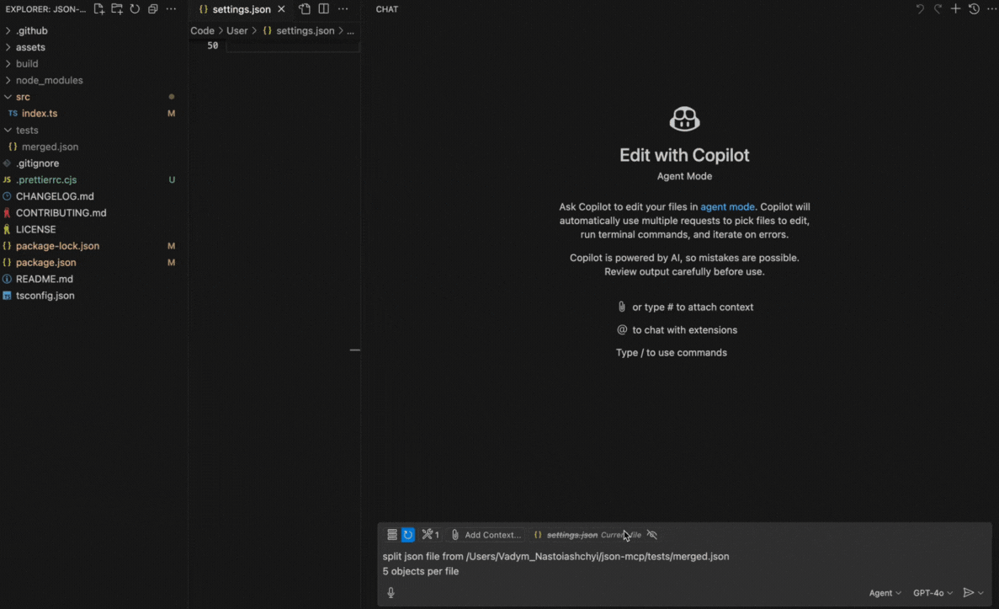

## JSON MCP

A Model Context Protocol (MCP) server enables LLMs to interact with JSON file/s (split, merge, find specific data within conditions)

### Key Features

- **Fast and lightweight**
- **LLM-friendly**

### Use Cases

- Split one large JSON file into smallest parts

### Demo


### Example config

```js
// User Settings (JSON)
  "mcp": {
    "servers": {
      "json-mcp-server": {
        "command": "npx",
        "args": ["json-mcp-server@latest"]
      }
    }
  },
```

### Installation in VS Code

You can install the Playwright MCP server using the VS Code CLI:

```bash
# For VS Code
code --add-mcp '{"name":"json-mcp-server","command":"npx","args": ["json-mcp-server@latest"]}'
```

After installation, the JSON MCP server will be available for use with your GitHub Copilot agent in VS Code.

### Installation Server

#### Install globally

```bash
npm install -g json-mcp-server@latest
```

#### Run after global installation

```bash
json-mcp-server
```

#### Using npx with latest version (recommended)

```bash
npx json-mcp-server@latest
```
